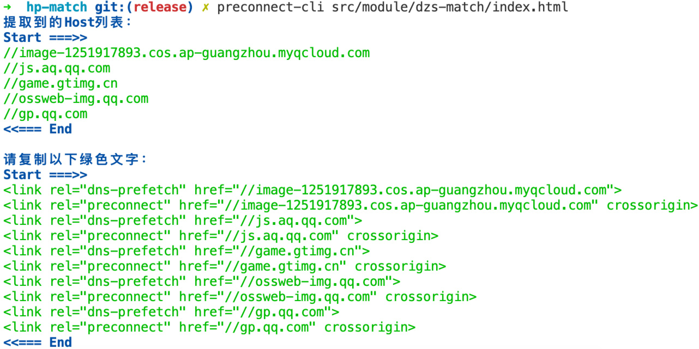

## 前端优化之`dns-prefetch`和`preconnect`

### `dns-prefetch`

`dns-prefetch`使浏览器主动去执行域名解析的功能，形式如下：

```html
<link rel="dns-prefetch" href="//example.com">
```

`href`属性值就是需要DNS预解析的`host`。

这只是一个很小的改进，但是对于高性能网站来说（如淘宝），任何优化都有帮助。


### `preconnet`

浏览器要建立一个连接，一般需要经过DNS查找，TCP三次握手和TLS协商（如果是`https`的话），这些过程都是需要相当的耗时的。

所以`preconnet`，就是一项使浏览器能够预先建立一个连接，等真正需要加载资源的时候就能够直接请求了。

而一般形式就是：

```html
<link rel="preconnect" href="//example.com">
<link rel="preconnect" href="//cdn.example.com" crossorigin>
```

注意`preconnect`包含了`dns-prefetch`过程。

一般情况下，`dns-prefetch`和`preconnect`写在`header`标签靠前的位置，我们可以写在最后一个`meta`标签后面。

此外，还有容易混淆的两个概念，`prefetch`和`prerender`。

### `prefetch`

能够让浏览器预加载一个资源（HTML，JS，CSS或者图片等），可以让用户跳转到其他页面时，响应速度更快。

一般形式就是

```html
<link rel="prefetch" href="//example.com/next-page.html" as="html" crossorigin="use-credentials">
<link rel="prefetch" href="/library.js" as="script">
```


虽然是预加载了，但是页面是不会解析或者JS是不会直接执行的。


### `prerender`

`prerender`不仅会加载资源，还会解执行页面，进行预渲染，但是这都是根据浏览器自身进行判断。

浏览器可能会：
1. 分配少量资源对页面进行预渲染
2. 挂起部分请求直至页面可见时
3. 可能会放弃预渲染，如果消耗资源过多

一般形式：
```html
<link rel="prerender" href="//example.com/next-page.html">
```

### 自动化工具

我写了一个工具，能够搜索文件中的host地址，并生成`dns-prefetch`和`preconnect`的HTML内容，地址在[这里](https://github.com/novlan1/preconnect-cli)，示例如下图。





参考：
1. [DNS prefetch vs preconnect](http://www.7loops.com/dns-prefetch-vs-preconnect/)
2. [Head标签里面的dns-prefetch，preconnect，prefetch和prerender](https://www.cnblogs.com/cangqinglang/p/13818716.html)