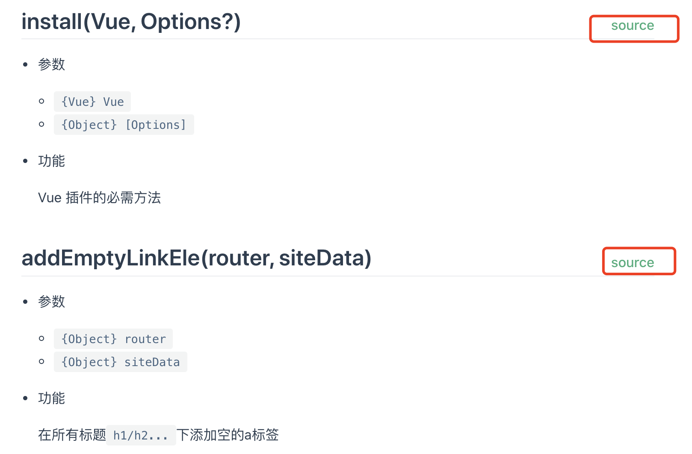
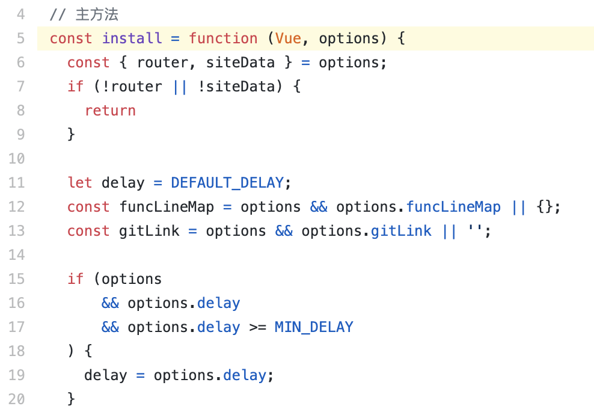

## v-func-line

为Vuepress文档增加源代码链接的插件

### 使用方法

1、安装包

```bash
npm install v-func-line --save-dev
```

2、在`.vuepress/enhanceApp.js`中使用

```js
import VFuncLine from 'v-func-line';

const funcLineMap = {
  "src-install": "./src/index.js#L5",
  "src-addEmptyLinkEle": "./src/index.js#L35",
}

export default({
  Vue,
  router,
  siteData
}) => {
  Vue.use(VFuncLine, {
    router,
    siteData,
    funcLineMap, // 函数和文件名行号的对象
    delay: 300, // mounted后的延迟执行时间
    gitLink: 'https://github.com/novlan1/v-func-line/blob/master', // git仓库路径地址
  });
}
```

### Demo文档

点击[这里](https://novlan1.github.io/v-func-line/)可以查看插件效果

### 注意

1. `funcLineMap`的键名形式为`${文件名}-${函数名}`；
2. `funcLineMap`的键名不能重复，会覆盖，也就是说不要让文件名和函数名都相同;
3. `funcLineMap`的值名与`gitLink`拼接后为文件真实路径;

### 效果

文档中：

<p></p>

点击后跳转到Git仓库：
<p></p>

